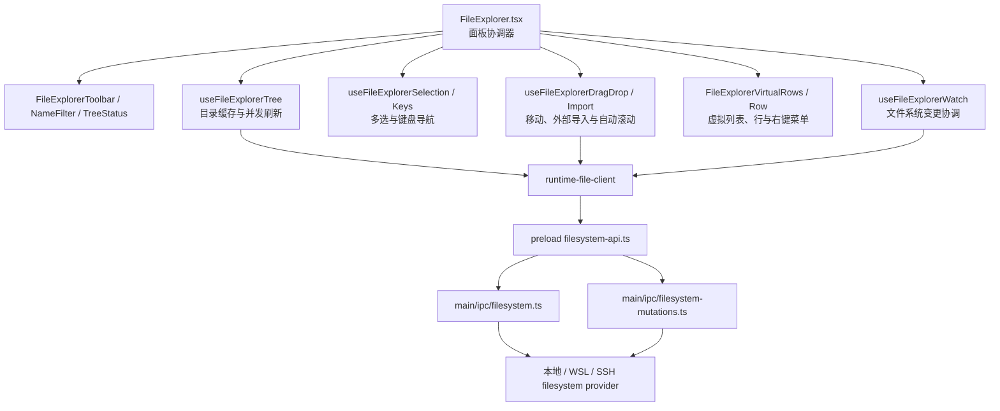

# Orca Explorer 迁移与依赖关系

基准源码：`../orca-src/orca-main`，主要入口为
`src/renderer/src/components/right-sidebar/FileExplorer.tsx`。

## 依赖关系图

## 当前项目对应关系

| Orca 职责 | 当前项目实现 |
| --- | --- |
| 面板、工具栏、名称过滤、树协调 | `src/features/explorer/Explorer.tsx` |
| 文件/目录行、展开、选择、拖拽目标 | `src/features/explorer/ExplorerRow.tsx` |
| 行内新建与重命名 | `src/features/explorer/InlineInput.tsx` |
| 右键菜单 | `src/features/explorer/ContextMenu.tsx` |
| 文件类型图标与工具栏图标 | `src/features/explorer/icons.tsx` |
| Tauri 调用与 watcher 事件 | `src/features/explorer/api.ts` |
| 目录读取、创建、重命名、移动、回收站删除、复制、系统定位、watcher | `src-tauri/src/explorer/fs.rs` |
| 命令注册与插件 | `src-tauri/src/main.rs`、`src-tauri/Cargo.toml` |

## 已适配能力

- 懒加载文件树、展开/折叠、全部折叠、手动刷新和文件系统自动刷新。
- 单选、平台化 Ctrl/Cmd 多选、Shift 区间选择和方向键导航。
- 新建文件/目录、行内重命名、回收站删除、复制、拖拽移动。
- 文件/目录右键菜单、空白区域菜单、系统文件管理器定位。
- 绝对/相对路径复制（支持多选）、查看文件、目录子树折叠菜单。
- 隐藏文件与 Git ignored 文件开关、递归名称过滤、暗色/亮色样式和常见文件类型配色。
- 拖拽悬停自动展开目录、刷新旋转反馈、文件操作撤销/重做快捷键与菜单。
- Tauri 不可用时的浏览器预览降级。
- 所有后端相对路径限制在当前项目内，拒绝路径穿越和把目录移动到自身子目录。

## 与 Orca 原版仍有差异

- Orca 使用 Electron preload + 本地/WSL/SSH provider；当前项目使用 Tauri 本地文件系统，尚无 WSL/SSH 文件提供器。
- Orca 对超大目录使用虚拟列表、并发刷新代次和精细 watcher reconcile；当前项目采用适合现有体量的扁平 React 列表与防抖全量刷新。
- Orca 还提供外部文件授权导入、下载远端文件、在终端打开、文件夹内全文搜索等与其 Electron/远程运行时/终端体系耦合的动作；当前项目没有对应宿主能力。
- 当前撤销/重做覆盖新建、重命名、复制和移动；回收站删除无法可靠获得跨平台恢复句柄，因此不会伪造可撤销删除。
- 当前删除确认使用系统确认框；Orca 使用自身对话框与 toast 体系。
